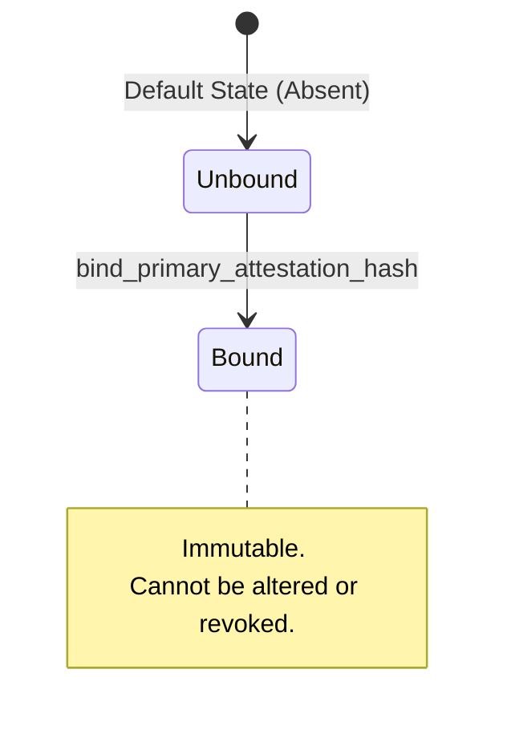
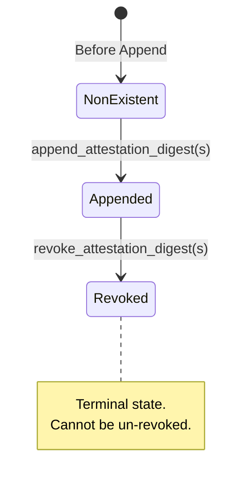

# Attestation State Machine

This document outlines the state machine for attestations within the Starfund escrow contract. Attestations are managed through two distinct mechanisms: the **Primary Attestation Hash** (single-set) and the **Attestation Append Log** (append-only with revocation).

## 1. Primary Attestation Hash

The `PrimaryAttestationHash` is a single-set, immutable off-chain attestation digest (e.g., SHA-256 of a legal or KYC bundle) that can only be written once by an administrator.

### Enforcing Entrypoints
- **`StarfundEscrow::bind_primary_attestation_hash`**: Transitions the state from `Unbound` (absent) to `Bound`. If called when the state is already `Bound`, the contract rejects the transaction with a `PrimaryAttestationAlreadyBound` error.

---

## 2. Attestation Append Log

The `AttestationAppendLog` provides an append-only audit chain of digests. Individual digests inside the log can be explicitly revoked, but the log itself cannot be shortened or deleted. The size of the log is bounded by `MAX_ATTESTATION_APPEND_ENTRIES`.

### Enforcing Entrypoints
- **`StarfundEscrow::append_attestation_digest`** / **`append_attestation_digests`**: 
  Transitions a new digest from `NonExistent` to `Appended`. The new digest is placed at the next available index in the log. If the log reaches `MAX_ATTESTATION_APPEND_ENTRIES`, it rejects the transaction with `AttestationAppendLogCapacityReached`.
- **`StarfundEscrow::revoke_attestation_digest`** / **`revoke_attestation_digests`**: 
  Transitions an `Appended` digest to `Revoked` by setting the `AttestationRevoked(index)` DataKey. 
  - If the index is out of bounds, it rejects with `AttestationIndexOutOfRange`.
  - If the digest is already revoked, it rejects with `AttestationAlreadyRevoked`.
