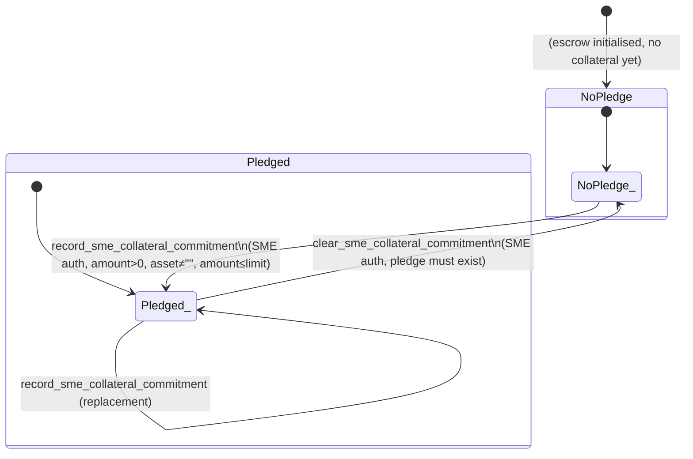

# Collateral State Diagram

This document describes the state machine for the **SME collateral commitment** in the StarFund escrow contract. Collateral is metadata-only and intentionally orthogonal to the escrow lifecycle status — no collateral operation reads or writes the escrow `status` field.

---

## State Definitions

The collateral pledge has exactly two states, tracked by the presence or absence of a value under `DataKey::SmeCollateralPledge` in instance storage.

| State | Storage | Meaning |
|---|---|---|
| **NoPledge** | `DataKey::SmeCollateralPledge` absent (`None`) | No collateral commitment has been recorded, or it has been cleared. |
| **Pledged** | `DataKey::SmeCollateralPledge` = `SmeCollateralCommitment { asset, amount, recorded_at }` | The SME has recorded a collateral commitment. Overwriting produces a new `SmeCollateralCommitment` (timestamp advancement is enforced). |

### Separately tracked: `CollateralLimit`

The collateral limit (`DataKey::CollateralLimit`) is an admin-configured ceiling that defaults to `MAX_INVOICE_AMOUNT` when absent. It is **not** a state of the pledge machine — it is a config value read by the `record_sme_collateral_commitment` guard and mutated by `set_collateral_limit`. See [Transition Matrix](#transition-matrix) for enforcement.

---

## State Transition Diagram

---

## Transition Matrix

| Entrypoint | Source State(s) | Target State | Authorised Role | Precondition Guards | Error on Violation |
|---|---|---|---|---|---|
| `record_sme_collateral_commitment` (line 3795) | NoPledge, Pledged | Pledged | SME (`require_auth`) | `amount > 0` | `CollateralAmountNotPositive` (60) |
| | | | | `asset != ""` | `CollateralAssetEmpty` (61) |
| | | | | `amount <= get_collateral_limit()` | `CollateralLimitExceeded` (64) |
| | | | | if replacing: `recorded_at >= prior.recorded_at` | `CollateralTimestampBackwards` (62) |
| | | | | escrow must exist | `EscrowNotInitialized` (20) |
| `clear_sme_collateral_commitment` (line 3457) | Pledged | NoPledge | SME (`require_auth`) | `collateral_pledge_get` must return `Some` | `NoCollateralToClear` (169) |
| `set_collateral_limit` (line 3396) | — (orthogonal) | — (updates config) | Admin (`require_auth`) | `new_limit > 0` | `CollateralLimitNotPositive` (63) |
| | | | | `new_limit <= MAX_INVOICE_AMOUNT` | `CollateralLimitExceedsMax` (65) |

All read-only entrypoints (`get_sme_collateral_commitment` line 3351, `get_collateral_limit` line 3360, `get_collateral_config` line 3370, `get_collateral_records` line 3425) have no state transition effect and require no authorisation.

---

## Guard Ordering

Within each mutating entrypoint, guards are evaluated in a fixed sequence so that cheaper / broader checks fail before expensive or context-dependent ones.

### `record_sme_collateral_commitment` guard order (line 3795)

1. `amount > 0` — integer check, no I/O
2. `asset != ""` — symbol comparison, no I/O
3. `amount <= get_collateral_limit()` — one storage read (`DataKey::CollateralLimit`)
4. `load_escrow_require_sme` — one storage read + one `require_auth` (SME)
5. if prior pledge exists: `recorded_at >= prior.recorded_at` — one storage read (`DataKey::SmeCollateralPledge`)

### `clear_sme_collateral_commitment` guard order (line 3457)

1. `collateral_pledge_get` returns `Some` — one storage read, fails early with `NoCollateralToClear` (169)
2. `load_escrow_require_sme` — one storage read + `require_auth` (SME)

### `set_collateral_limit` guard order (line 3396)

1. `load_escrow_require_admin` — one storage read + `require_auth` (Admin)
2. `new_limit > 0`
3. `new_limit <= MAX_INVOICE_AMOUNT`

---

## Storage Helpers

All reads and writes to `DataKey::SmeCollateralPledge` are routed through three private helpers (lines 3089–3105):

| Helper | Line | Effect |
|---|---|---|
| `collateral_pledge_get` | 3089 | Returns `Option<SmeCollateralCommitment>` |
| `collateral_pledge_set` | 3094 | Writes a new commitment |
| `collateral_pledge_remove` | 3101 | Removes the pledge (transition to NoPledge) |

---

## Audit Log

Every successful call to `record_sme_collateral_commitment` also appends the new `SmeCollateralCommitment` to an append-only vector under `DataKey::CollateralRecords` (line 3835). This log is independent of the pledge state machine and provides a full history of commitments. It is readable via `get_collateral_records` (line 3425, paginated, max page size 50).
