# Funding State Machine

This document describes the state machine governing investor funding in the Starfund escrow contract. It covers the five status values (`0`–`4`), their allowed transitions, the entrypoints that enforce each transition, and the typed errors raised for invalid operations.

---

## Overview

Funding begins when the contract is initialised with `init` and remains open until the escrow reaches a terminal state or the admin cancels it. The state is stored in `InvoiceEscrow.status` and is checked by every state-bearing entrypoint via `guard_status_eq`, `require_funding_open`, or `ensure`.

```mermaid
stateDiagram-v2
    [*] --> Open : init()

    Open --> Funded : fund() / fund_with_commitment() / fund_batch()\nwhen funded_amount >= funding_target\n\nOpen --> Funded : partial_settle() [admin | SME]\n\nOpen --> Funded : update_funding_target()\nlowering target to <= funded_amount

    Open --> Cancelled : cancel_funding() [admin]\nlegal hold must be inactive

    Funded --> Settled : settle() [SME]\nlegal hold must be inactive\nmaturity gate (if maturity > 0)

    Funded --> Withdrawn : withdraw() [SME]\nlegal hold must be inactive\noperational pause must be inactive

    Settled --> [*] : claim_investor_payout() [investor]\nlegal hold must be inactive\nclaim-not-before must have elapsed\nidempotent: second claim is a no-op

    Cancelled --> [*] : refund() [investor]\nlegal hold must be inactive\ncontribution > 0; idempotent
```

---

## States

| Value | Name | Description |
|-------|------|-------------|
| `0` | `Open` | Escrow accepts new principal. `fund()`, `fund_with_commitment()`, `fund_batch()`, and `unfund()` are permitted. Admin may cancel. |
| `1` | `Funded` | `funding_target` has been reached (auto-transition), or `partial_settle()` / `update_funding_target()` forced the transition. The escrow is no longer accepting new investors, but the SME may settle or withdraw. |
| `2` | `Settled` | SME has finalised settlement. Investors may claim their payout via `claim_investor_payout()`. |
| `3` | `Withdrawn` | SME has withdrawn liquidity (pull model). Terminal state. |
| `4` | `Cancelled` | Admin cancelled funding while the escrow was open. Investors may reclaim principal via `refund()`. Terminal state for the funding direction. |

---

## Allowed Transitions

### 0 → 1 (Open → Funded)

Triggered when the escrow's recorded principal meets or exceeds the funding target, or when an admin/SME forces the transition early:

| Entrypoint | Auth | Guard | Notes |
|------------|------|-------|-------|
| `fund()` | investor | status == 0, legal hold inactive, pause inactive, amount > 0, per-investor cap, min contribution floor, allowlist, funding deadline | After deposit, checks `funded_amount >= funding_target`; transitions automatically |
| `fund_with_commitment()` | investor | same as `fund()` plus tiered yield guard | Same auto-transition when target is met |
| `fund_batch()` | investor (per-entry) | each entry passes `fund()` guards individually | If any entry triggers the threshold, `FundingCloseSnapshot` is written once |
| `partial_settle()` | admin or SME | status == 0, legal hold inactive | Forces `0 → 1` regardless of `funded_amount vs funding_target` |
| `update_funding_target()` | admin | status == 0, new target < current target | If new target <= `funded_amount`, auto-transition triggers |

### 0 → 4 (Open → Cancelled)

| Entrypoint | Auth | Guard | Notes |
|------------|------|-------|-------|
| `cancel_funding()` | admin | status == 0, legal hold inactive | Emits `FundingCancelled`; irreversible |

### 1 → 2 (Funded → Settled)

| Entrypoint | Auth | Guard | Notes |
|------------|------|-------|-------|
| `settle()` | SME | status == 1, legal hold inactive, pause inactive | If `maturity > 0`, also requires `now >= maturity`. Emits `EscrowSettled`. |

### 1 → 3 (Funded → Withdrawn)

| Entrypoint | Auth | Guard | Notes |
|------------|------|-------|-------|
| `withdraw()` | SME | status == 1, legal hold inactive, pause inactive | Splits `funded_amount` into protocol fee and SME payout via SEP-41 transfer. Emits `EscrowWithdrawn`. |

### 2 → Terminal (Settled → Claimed)

| Entrypoint | Auth | Guard | Notes |
|------------|------|-------|-------|
| `claim_investor_payout()` | investor | status == 2, legal hold inactive, contribution > 0, `now >= InvestorClaimNotBefore`, idempotent (second claim is no-op) | Computes pro-rata payout, transfers tokens, zeroes `InvestorContribution`. |

### 4 → Terminal (Cancelled → Refunded)

| Entrypoint | Auth | Guard | Notes |
|------------|------|-------|-------|
| `refund()` | investor | status == 4, legal hold inactive, contribution > 0 | Transfers investor contribution back, zeroes it (checks-effects-interactions). |

`refund_batch()` follows the same entrypoint rules per entry.

### 0 → 0 (Open remains Open)

The following operations are valid while the escrow remains in status `0` but do not change the status:

| Entrypoint | Description |
|------------|-------------|
| `fund()` / `fund_with_commitment()` / `fund_batch()` | Adds investor principal; status only flips to 1 when target is met |
| `unfund()` | Reduces investor principal; status stays 0 |
| `raise_max_per_investor()` | Admin raises per-investor cap |
| `lower_max_per_investor()` | Admin lowers per-investor cap |
| `raise_max_unique_investors()` | Admin raises unique investor cap |
| `lower_max_unique_investors()` | Admin lowers unique investor cap |
| `lower_min_contribution_floor()` | Admin lowers the per-deposit minimum |
| `extend_funding_deadline()` | Admin pushes the funding deadline forward |
| `update_funding_deadline()` | Admin sets or updates the deadline |
| `set_legal_hold()` | Admin toggles compliance hold |
| `propose_admin()` / `accept_admin()` | Admin key rotation |

---

## Forbidden Transitions (must panic)

| From | To | Entrypoint | Error |
|------|----|------------|-------|
| `0` (Open) | `1` (Funded) | `fund()` / `fund_with_commitment()` / `fund_batch()` when `funded_amount < funding_target` | No transition triggered; funding continues |
| `0` (Open) | `2` (Settled) | `settle()` | `SettlementNotFunded` (142) |
| `0` (Open) | `3` (Withdrawn) | `withdraw()` | `WithdrawalNotFunded` (140) |
| `0` (Open) | `4` (Cancelled) | `cancel_funding()` after already cancelled | `CancelFundingNotOpen` (141) |
| `1` (Funded) | `0` (Open) | any | `EscrowNotOpenForFunding` (117); status never regresses |
| `1` (Funded) | `4` (Cancelled) | `cancel_funding()` | `CancelFundingNotOpen` (141) |
| `2` (Settled) | any | `fund()`, `fund_with_commitment()`, `fund_batch()`, `cancel_funding()` | `EscrowNotOpenForFunding` (117) or `CancelFundingNotOpen` (141) |
| `3` (Withdrawn) | any | `fund()`, `settle()`, `cancel_funding()` | respective status-gate errors |
| `4` (Cancelled) | any | `fund()`, `fund_with_commitment()`, `fund_batch()`, `settle()`, `withdraw()` | respective status-gate errors |

---

## Funding Sub-State: Per-Investor Commitment Lock

Within the Open state, each investor can optionally enter a commitment lock via `fund_with_commitment()`. This creates a `DataKey::InvestorClaimNotBefore` timestamp that gates future payout claims.

```mermaid
stateDiagram-v2
    [*] --> NoLock : First deposit via fund()\nOR fund_with_commitment(lock_secs = 0)

    NoLock --> LockActive : fund_with_commitment(lock_secs > 0)\n[first deposit only, prev == 0]

    LockActive --> LockActive : fund() follow-on deposit\n[prev > 0; lock unchanged]

    note right of LockActive
        LockActive persists until payout.
        claim_investor_payout() requires
        now >= InvestorClaimNotBefore.
    end note
```

### Enforcing Entrypoints

| Entrypoint | Sub-State Rule |
|------------|---------------|
| `fund()` | When `prev == 0`, writes `InvestorEffectiveYield = yield_bps` and `InvestorClaimNotBefore = 0` (no lock). When `prev > 0`, reads stored values unchanged. |
| `fund_with_commitment()` | When `prev == 0`, resolves the highest tier with `min_lock_secs <= committed_lock_secs`, writes `InvestorEffectiveYield` and `InvestorClaimNotBefore = now + lock_secs`. When `prev > 0`, panics with `TieredSecondDeposit` (108) because tiered locking is first-deposit-only. |

### Errors

| Error Code | Variant | Trigger |
|------------|---------|---------|
| `108` | `TieredSecondDeposit` | `fund_with_commitment()` called when `prev > 0` |
| `111` | `CommitmentLockExceedsMaturity` | `now + lock_secs > maturity` and both are > 0 |
| `109` | `InvestorClaimTimeOverflow` | `now + lock_secs` overflows `u64` |

---

## Entrypoint Enforcement Cross-Reference

| Entrypoint | Signer Role | Status Precondition | State Effect |
|------------|-------------|--------------------:|--------------|
| `init` | admin | Contract uninitialized | Creates escrow with `status = 0` (Open) |
| `fund` | investor | `status == 0` (Open) | Adds amount to `funded_amount` and `InvestorContribution(investor)`. Flips `status` to 1 if `funded_amount >= funding_target`. |
| `fund_with_commitment` | investor | `status == 0` (Open) | Same as `fund()` plus writes `InvestorEffectiveYield` and `InvestorClaimNotBefore` on first deposit (`prev == 0`). |
| `fund_batch` | investor (per-entry) | `status == 0` (Open) | Each entry routed through `fund_impl`. Same transition logic as `fund()`. |
| `unfund` | investor | `status == 0` (Open) | Decrements `funded_amount` and `InvestorContribution(investor)`. Status remains 0. |
| `partial_settle` | admin or SME | `status == 0` (Open) | Forces `status = 1` (Funded). Records `FundingCloseSnapshot`. |
| `update_funding_target` | admin | `status == 0` (Open) | May trigger `0 → 1` if new target <= `funded_amount`. |
| `cancel_funding` | admin | `status == 0` (Open) | Sets `status = 4` (Cancelled). |
| `settle` | SME | `status == 1` (Funded) | Sets `status = 2` (Settled). Records `SettledAt`. |
| `withdraw` | SME | `status == 1` (Funded) | Sets `status = 3` (Withdrawn). Transfers `funded_amount` to SME (`net`) and protocol fee to treasury. |
| `claim_investor_payout` | investor | `status == 2` (Settled) | Transfers payout to investor; zeroes `InvestorContribution`. |
| `refund` | investor | `status == 4` (Cancelled) | Transfers contribution back to investor; zeroes `InvestorContribution`. |
| `refund_batch` | investor (per-entry) | `status == 4` (Cancelled) | Same as `refund()` per entry. |
| `sweep_terminal_dust` | treasury | `status` is terminal (2, 3, or 4) | Sweeps rounding residue; preserves liability floor. |

---

## Related Documentation

- [`escrow-lifecycle.md`](escrow-lifecycle.md) — Full escrow lifecycle including status transitions, fee model, and investor paths.
- [`funding-invariants.md`](funding-invariants.md) — Detailed invariants for the funding subsystem.
- [`escrow-data-model.md`](escrow-data-model.md) — `InvoiceEscrow` struct and storage keys.
- [`escrow-events.md`](escrow-events.md) — Event schema for `EscrowFunded`, `FundingCancelled`, `InvestorPayoutClaimed`, etc.
- [`docs/adr/ADR-001-state-model.md`](adr/ADR-001-state-model.md) — Architectural decision record on the state model.
- [`pause-auth.md`](pause-auth.md) — Operational pause authorization and gate semantics.
- [`settlement-auth.md`](settlement-auth.md) — Settlement and withdrawal authorization boundaries.
- [`beneficiary-auth.md`](beneficiary-auth.md) — Beneficiary role and auth boundaries.