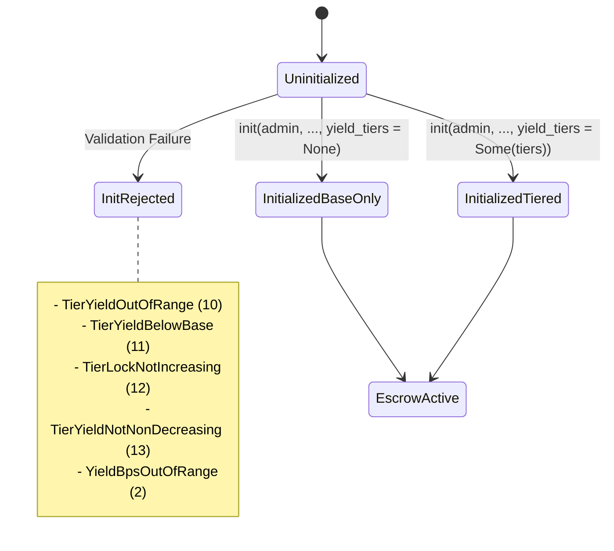
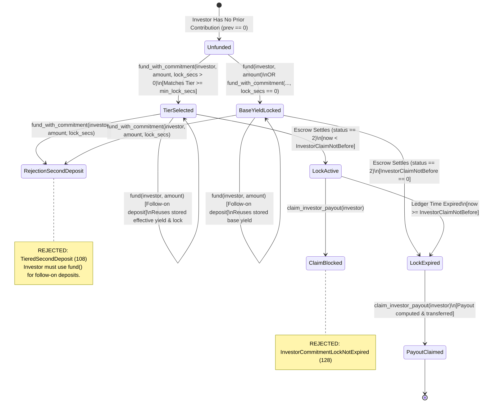
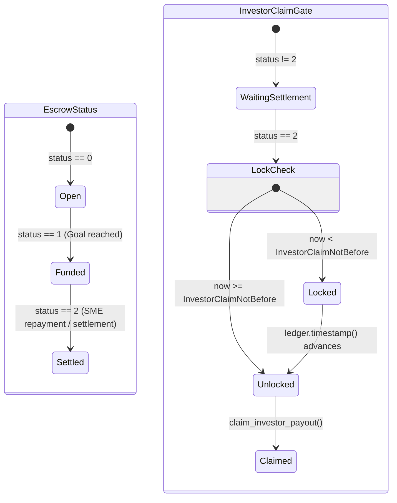

# Yield-Tier State Machine and Allowed Transitions

## Overview

The StarFund escrow contract supports an optional **Yield-Tier and Commitment Lock** mechanism ([ADR-005](adr/ADR-005-tiered-yield.md)). This feature permits investors to lock their capital for a minimum duration (`min_lock_secs`) in exchange for a higher annual yield (`yield_bps`).

This document details the state machine governing yield-tier table initialization, per-investor tier selection, state transitions, entrypoint enforcement, and typed failure rejections.

---

## Key Invariants

1. **Immutable Tier Table:** The tier table (`Option<Vec<YieldTier>>`) is configured once during `init` by the escrow admin. No entrypoint exists to mutate, append, or delete tiers after initialization.
2. **Once-Only Tier Selection:** An investor selects a yield tier (or locks in base yield) **strictly on their first deposit** (`prev == 0`). Subsequent deposits (`prev > 0`) cannot change or upgrade the effective yield rate or lock duration.
3. **Immutable Effective Rate:** Once written under `DataKey::InvestorEffectiveYield(investor)`, the investor's effective yield rate is immutable.
4. **Anchored Claim Lock:** The commitment lock timestamp (`DataKey::InvestorClaimNotBefore(investor)`) is calculated as `ledger.timestamp() + committed_lock_secs` on the first deposit. It is never reset or extended by follow-on deposits.
5. **Fair Payout Gate:** An investor whose lock has not elapsed (`ledger.timestamp() < InvestorClaimNotBefore`) is blocked from claiming their payout, even if the escrow has settled (`escrow.status == 2`).

---

## State Machine Diagrams

### 1. Tier Table Setup & Init Validation Machine

### 2. Per-Investor Commitment Lifecycle State Machine

### 3. Escrow Settlement and Claim Lock Integration

---

## Detailed State Definitions

| State | Condition | State Variables & Storage | Allowed Transitions |
|---|---|---|---|
| **Unfunded** | Investor has no recorded principal in escrow (`prev == 0`). | `DataKey::InvestorContribution(investor)` = `None` (0) | `fund_with_commitment` → `TierSelected` or `BaseYieldLocked` `fund` → `BaseYieldLocked` |
| **TierSelected** | First deposit made via `fund_with_commitment` with valid tier lock. | `InvestorContribution > 0` `InvestorEffectiveYield` = tier `yield_bps` `InvestorClaimNotBefore` = `now + lock_secs` | `fund` → `TierSelected` (Follow-on) `claim_investor_payout` → `PayoutClaimed` (when settled & `now >= lock`) |
| **BaseYieldLocked** | First deposit made via `fund()` or `fund_with_commitment(..., lock_secs=0)`. | `InvestorContribution > 0` `InvestorEffectiveYield` = base `yield_bps` `InvestorClaimNotBefore` = `0` | `fund` → `BaseYieldLocked` (Follow-on) `claim_investor_payout` → `PayoutClaimed` (when settled) |
| **LockActive** | Escrow status is Settled (`2`), but commitment lock duration has not elapsed. | `escrow.status == 2` `ledger.timestamp() < InvestorClaimNotBefore` | Time progression → `LockExpired` `claim_investor_payout` → Rejected (`InvestorCommitmentLockNotExpired`) |
| **LockExpired** | Escrow status is Settled (`2`), and commitment lock duration has elapsed (or lock=0). | `escrow.status == 2` `ledger.timestamp() >= InvestorClaimNotBefore` | `claim_investor_payout` → `PayoutClaimed` |
| **PayoutClaimed** | Investor claimed principal plus tiered interest. | `InvestorContribution == 0` (cleared upon payout) | Terminal state |

---

## Entrypoint Enforcement Cross-Reference

| Entrypoint | Signer Role | State Preconditions Enforced | Outcome / State Update |
|---|---|---|---|
| `init` | `admin` | Contract not yet initialized (`status` uninitialized). | Validates & stores base `yield_bps` and optional `YieldTierTable`. |
| `fund_with_commitment` | `investor` | 1. `escrow.status == 0` (Open) 2. `prev == 0` (No prior deposit) 3. `now + committed_lock_secs <= maturity` (if maturity > 0) | Resolves highest tier with `min_lock_secs <= committed_lock_secs`. Writes `InvestorEffectiveYield` and `InvestorClaimNotBefore`. |
| `fund` | `investor` | `escrow.status == 0` (Open). Accepts `prev == 0` or `prev > 0`. | Adds `amount` to `InvestorContribution`. If `prev == 0`, locks base yield. If `prev > 0`, reuses stored `InvestorEffectiveYield`. |
| `fund_batch` | entry `investor`s | Evaluates each entry through `fund_impl` under same state rules as `fund`/`fund_with_commitment`. | Batch updates investor contributions. |
| `claim_investor_payout` | `investor` | 1. `escrow.status == 2` (Settled) 2. `contribution > 0` 3. `ledger.timestamp() >= InvestorClaimNotBefore` | Computes payout using `InvestorEffectiveYield` (or fallback base), transfers tokens, clears contribution. |
| `preview_yield_tier` | *None (Read)* | None (Simulates hypothetical deposit amount & lock duration against tier table). | Returns `(effective_yield_bps, matched_lock_secs)`. |
| `get_yield_tiers` | *None (Read)* | None | Returns stored `Vec<YieldTier>`. |
| `get_effective_yield_bps` | *None (Read)* | None | Returns `InvestorEffectiveYield` if set; otherwise escrow base `yield_bps`. |
| `get_investor_claim_not_before` | *None (Read)* | None | Returns `InvestorClaimNotBefore(investor)` timestamp. |

---

## Rejections & Error Code Registry

| Error Code | Error Variant | Triggered At | Cause / State Violation |
|---:|---|---|---|
| **10** | `TierYieldOutOfRange` | `init` | A tier's `yield_bps` is outside `0..=10_000`. |
| **11** | `TierYieldBelowBase` | `init` | A tier's `yield_bps` is less than escrow base `yield_bps`. |
| **12** | `TierLockNotIncreasing` | `init` | Tier `min_lock_secs` values are not strictly increasing. |
| **13** | `TierYieldNotNonDecreasing` | `init` | A tier's `yield_bps` decreases relative to a shorter tier. |
| **108** | `TieredSecondDeposit` | `fund_with_commitment` | Called by an investor who already has principal (`prev > 0`). |
| **111** | `CommitmentLockExceedsMaturity` | `fund_with_commitment` | `now + committed_lock_secs` extends past escrow maturity. |
| **128** | `InvestorCommitmentLockNotExpired` | `claim_investor_payout` | Attempted claim while `ledger.timestamp() < InvestorClaimNotBefore`. |

---

## Related Documentation

- [ADR-005: Optional Tiered Yield and Commitment Locks](adr/ADR-005-tiered-yield.md) — Architectural design and test coverage matrix.
- [Yield-Tier Auth & Access Rules](yield-tier-auth.md) — Detailed authorization matrix and role boundaries.
- [Yield-Tier Errors Reference](yield-tier-errors.md) — Typed error reference for yield-tier configuration and execution.
- [Escrow Read API](escrow-read-api.md) — Complete specification for yield-tier read functions.
